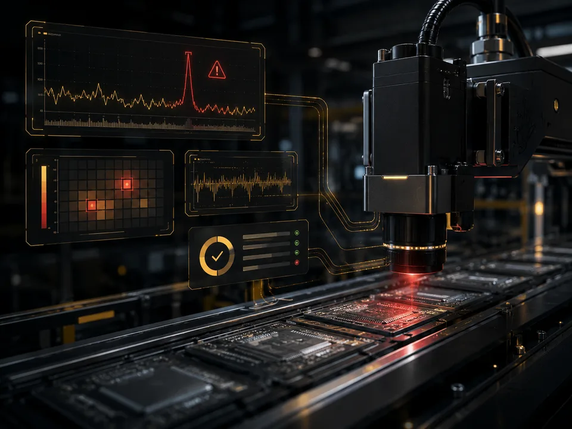
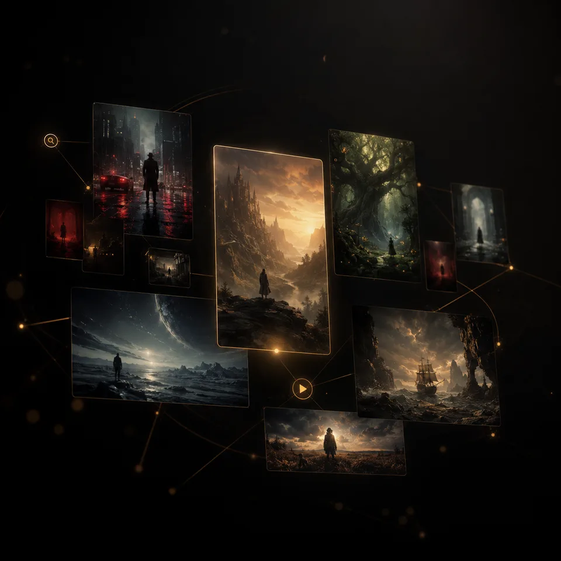
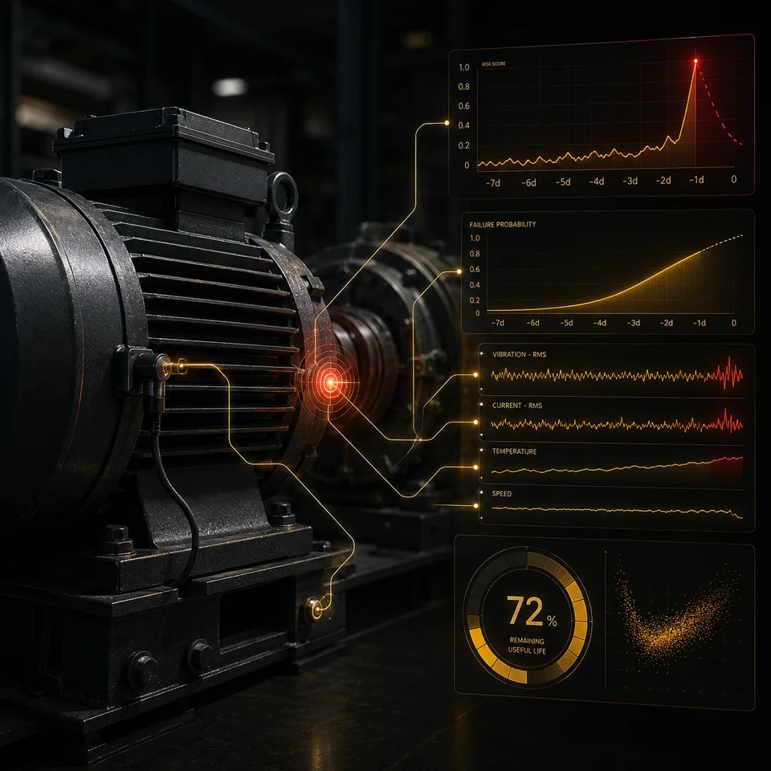
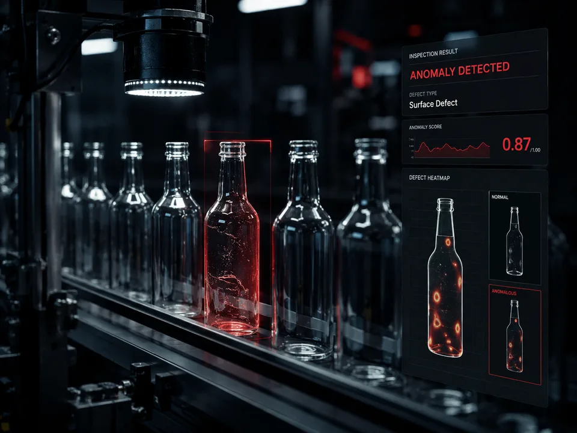
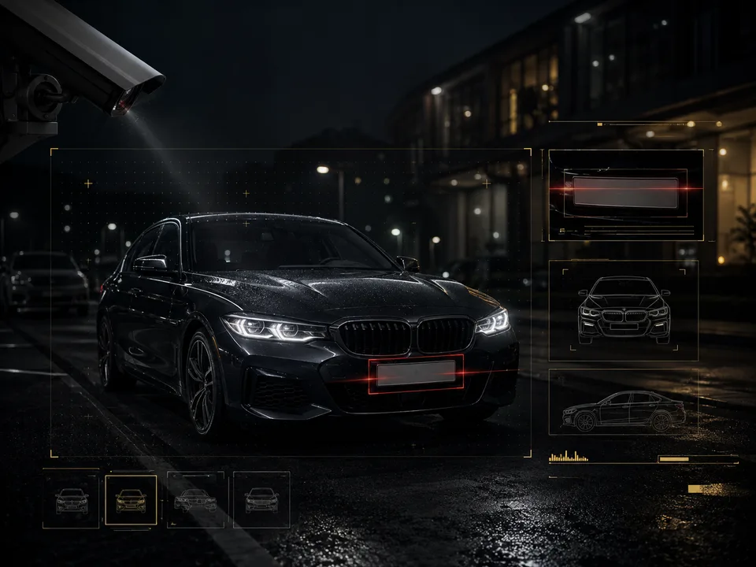
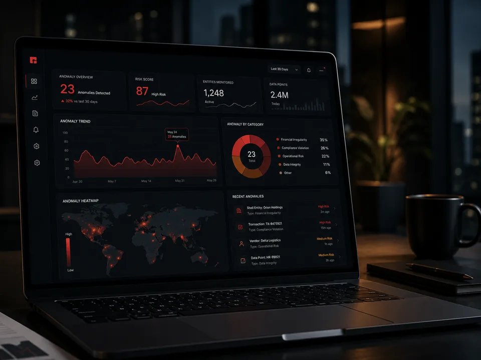
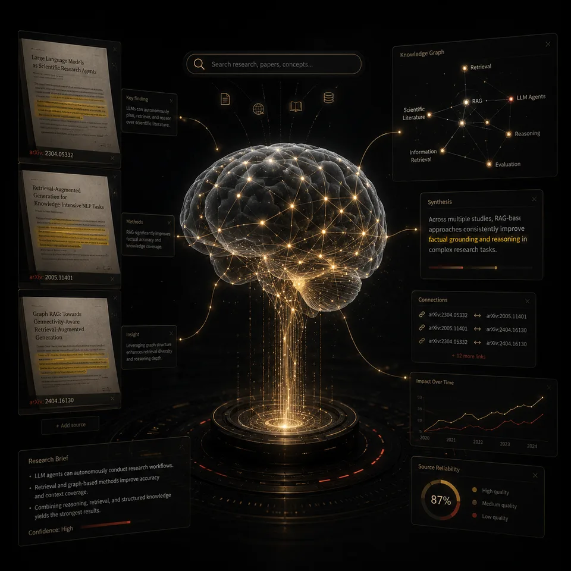
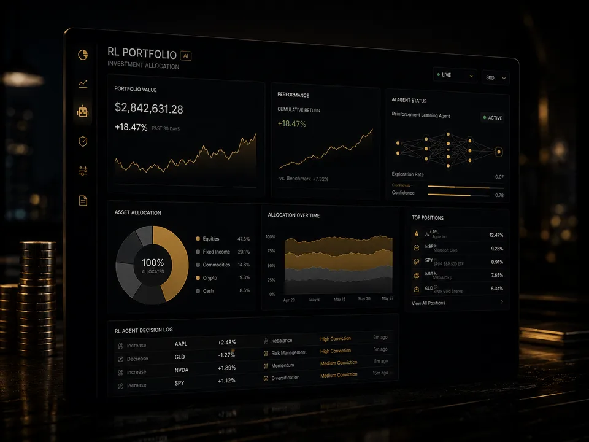

<div align="center">


# Sidnei Almeida

**AI Engineering Portfolio · React · TypeScript · Python · Live Demos**


<sub>Source for <a href="https://sidnei-almeida.github.io/">sidnei-almeida.github.io</a> — ThinkPad-inspired dark UI, project grid, resume export, and guided Python exercise.</sub>

<br/>

<p>
<a href="https://sidnei-almeida.github.io/"></a>
<a href="https://sidnei-almeida.github.io/projects"></a>
<a href="https://www.linkedin.com/in/saaelmeida93/"></a>
<a href="mailto:sidnei.almeida1806@gmail.com"></a>
</p>

<br/>

<p align="center">

</p>

<br/>

<hr style="border:0;background:linear-gradient(90deg,transparent,rgba(56,139,253,0.45),rgba(137,87,229,0.35),rgba(63,185,80,0.45),transparent);height:2px;margin:10px auto 0 auto;max-width:760px;"/>

</div>

<br/>

## About this repository

Personal portfolio site built with **React 19**, **Vite**, **TypeScript**, and **Tailwind CSS**. It showcases end-to-end AI work — computer vision, RAG, recommender systems, industrial monitoring, and quantitative dashboards — each with a **live hosted demo**, not static screenshots only.

| | |
| :--- | :--- |
| **Live site** | [sidnei-almeida.github.io](https://sidnei-almeida.github.io/) |
| **Projects grid** | [/projects](https://sidnei-almeida.github.io/projects) |
| **Resume (ATS PDF)** | [/resume/print](https://sidnei-almeida.github.io/resume/print) |
| **Python exercise (USP)** | [/exercises/analise-pedidos-python](https://sidnei-almeida.github.io/exercises/analise-pedidos-python) |

<br/>

## Core focus

<table>
<tr>
<td width="50%" valign="top">

**Ship end-to-end**  
Models, APIs, dashboards and deployment on Vercel / HF / Pages.

**Integrate cleanly**  
FastAPI backends, React or Next.js front ends, typed contracts.

</td>
<td width="50%" valign="top">

**Stay honest on metrics**  
Baselines, error analysis, slices that stress real failure modes.

**Compose AI systems**  
RAG, agents, CV pipelines — beyond a single notebook.

</td>
</tr>
</table>

<br/>

## Technical stack

<div style="background:#161b22;border:1px solid #30363d;border-radius:10px;border-left:4px solid #0969da;padding:14px 16px;margin:6px 0;">

**Frontend & site** — React · Vite · TypeScript · Tailwind · Framer Motion · React Router · i18n (PT / EN / ES)

</div>

<div style="background:#161b22;border:1px solid #30363d;border-radius:10px;border-left:4px solid #8250df;padding:14px 16px;margin:6px 0;">

**ML & vision** — PyTorch · TensorFlow · scikit-learn · YOLOv8 · OpenCV · LSTM · autoencoders · BERT

</div>

<div style="background:#161b22;border:1px solid #30363d;border-radius:10px;border-left:4px solid #1f6feb;padding:14px 16px;margin:6px 0;">

**APIs & AI products** — FastAPI · LangChain · FAISS · Groq · Hugging Face inference · PostgreSQL (Neon)

</div>

<div style="background:#161b22;border:1px solid #30363d;border-radius:10px;border-left:4px solid #8957e5;padding:14px 16px;margin:6px 0;">

**Deploy & ops** — GitHub Pages · Vercel · Docker · GitHub Actions · static SPA + `404.html` redirect

</div>

<br/>

## Featured projects

Screenshots in `public/assets/projects/` (WebP). Open the **[projects page](https://sidnei-almeida.github.io/projects)** for filters and the full grid.

<div style="display:flex;flex-wrap:wrap;gap:18px;align-items:flex-start;margin:18px 0;padding:16px 18px;border-radius:12px;border:1px solid #30363d;background:linear-gradient(145deg,rgba(56,139,253,0.09),rgba(22,27,34,0.35));border-left:4px solid #388bfd;">


<div style="flex:1;min-width:260px;">

### DocMind — RAG Document QA Assistant

<p>


</p>

PDF ingestion, semantic retrieval, source-grounded Q&A and document intelligence UI.

[**Repository**](https://github.com/sidnei-almeida/rag-document-qa-assistant) · [**Live demo**](https://rag-document-qa-assistant.vercel.app/)

</div></div>

<div style="display:flex;flex-wrap:wrap;gap:18px;align-items:flex-start;margin:18px 0;padding:16px 18px;border-radius:12px;border:1px solid #30363d;background:linear-gradient(145deg,rgba(137,87,229,0.09),rgba(22,27,34,0.35));border-left:4px solid #8957e5;">



<div style="flex:1;min-width:260px;">

### Real-Time Industrial Anomaly Monitor

<p>


</p>

SECOM-style replay, autoencoder scoring, alerts and ops dashboard.

[**Repository**](https://github.com/sidnei-almeida/industrial-iot-anomaly-monitor) · [**Live demo**](https://industrial-iot-anomaly-monitor.vercel.app/)

</div></div>

<div style="display:flex;flex-wrap:wrap;gap:18px;align-items:flex-start;margin:18px 0;padding:16px 18px;border-radius:12px;border:1px solid #30363d;background:linear-gradient(145deg,rgba(240,136,62,0.08),rgba(22,27,34,0.35));border-left:4px solid #f0883e;">



<div style="flex:1;min-width:260px;">

### CineScope Intelligence

<p>


</p>

Semantic movie discovery with BERT + TMDb enrichment, trailers and match scores.

[**Repository**](https://github.com/sidnei-almeida/tmdb-semantic-recommender) · [**Live demo**](https://cinescope-semantic-discovery.vercel.app/)

</div></div>

<div style="display:flex;flex-wrap:wrap;gap:18px;align-items:flex-start;margin:18px 0;padding:16px 18px;border-radius:12px;border:1px solid #30363d;background:linear-gradient(145deg,rgba(35,134,54,0.1),rgba(22,27,34,0.35));border-left:4px solid #238636;">



<div style="flex:1;min-width:260px;">

### PM Monitor · Predictive Maintenance

<p>


</p>

Real-time LSTM inference and control-room dashboard for sensor streams.

[**Repository**](https://github.com/sidnei-almeida/lstm-predictive-maintenance-dashboard) · [**Live demo**](https://lstm-predictive-maintenance-dashboa.vercel.app/)

</div></div>

<div style="display:flex;flex-wrap:wrap;gap:18px;align-items:flex-start;margin:18px 0;padding:16px 18px;border-radius:12px;border:1px solid #30363d;background:linear-gradient(145deg,rgba(218,54,51,0.07),rgba(22,27,34,0.35));border-left:4px solid #da3633;">



<div style="flex:1;min-width:260px;">

### Visual Anomaly Comparison Lab

<p>


</p>

MVTec-style bottle inspection: reconstruction, heatmaps, masks and scores.

[**Repository**](https://github.com/sidnei-almeida/visual-anomaly-comparison-lab) · [**Live demo**](https://visual-anomaly-comparison-lab.vercel.app/)

</div></div>

<div style="display:flex;flex-wrap:wrap;gap:18px;align-items:flex-start;margin:18px 0;padding:16px 18px;border-radius:12px;border:1px solid #30363d;background:linear-gradient(145deg,rgba(31,111,235,0.09),rgba(22,27,34,0.35));border-left:4px solid #1f6feb;">



<div style="flex:1;min-width:260px;">

### PlatePulse Vehicle Intelligence

<p>


</p>

Brazilian ALPR: YOLOv8 detection → crop → OCR, with pipeline metrics UI.

[**Repository**](https://github.com/sidnei-almeida/platepulse-vehicle-intelligence) · [**Live demo**](https://platepulse-vehicle-intelligence.vercel.app/)

</div></div>

<div style="display:flex;flex-wrap:wrap;gap:18px;align-items:flex-start;margin:18px 0;padding:16px 18px;border-radius:12px;border:1px solid #30363d;background:linear-gradient(145deg,rgba(88,166,255,0.08),rgba(22,27,34,0.35));border-left:4px solid #58a6ff;">



<div style="flex:1;min-width:260px;">

### Corporate Signal Intelligence

<p>


</p>

Corporate anomaly detection + Groq executive briefings over market signals.

[**Repository**](https://github.com/sidnei-almeida/corporate-signal-intelligence-dashboard) · [**Live demo**](https://corporate-signal-intelligence-dashb.vercel.app/)

</div></div>

<div style="display:flex;flex-wrap:wrap;gap:18px;align-items:flex-start;margin:18px 0;padding:16px 18px;border-radius:12px;border:1px solid #30363d;background:linear-gradient(145deg,rgba(163,113,247,0.09),rgba(22,27,34,0.35));border-left:4px solid #a371f7;">



<div style="flex:1;min-width:260px;">

### Gray Matter LABS

<p>


</p>

Research workspace: arXiv, web tools, multi-chat memory and tool-aware Groq responses.

[**Repository**](https://github.com/sidnei-almeida/gray-matter-research-agent) · [**Live demo**](https://gray-matter-research-agent.vercel.app/)

</div></div>

<div style="display:flex;flex-wrap:wrap;gap:18px;align-items:flex-start;margin:18px 0;padding:16px 18px;border-radius:12px;border:1px solid #30363d;background:linear-gradient(145deg,rgba(63,185,80,0.1),rgba(22,27,34,0.35));border-left:4px solid #3fb950;">



<div style="flex:1;min-width:260px;">

### RL Portfolio Allocation Dashboard

<p>


</p>

PPO allocation, paper trading, risk guardrails and market replay (no live broker).

[**Repository**](https://github.com/sidnei-almeida/ai-trading-signals-dashboard) · [**Live demo**](https://ai-trading-signals-dashboard.vercel.app/)

</div></div>

<br/>

## Study materials

<div style="border:1px solid #30363d;border-radius:12px;background:linear-gradient(90deg,rgba(56,139,253,0.06),#161b22);padding:16px 20px;border-left:3px solid #58a6ff;">

**Análise de Pedidos com Python Básico** — guided exercise (USP ESALQ mentorship): setup by OS, venv, download `.py`, run locally. Not listed in the main projects grid.

[**Open exercise**](https://sidnei-almeida.github.io/exercises/analise-pedidos-python) · [`analise_pedidos_guiado.py`](https://sidnei-almeida.github.io/exercise_python/analise_pedidos_guiado.py)

</div>

<br/>

## Engineering approach

| Step | What this repo optimizes for |
| :--- | :--- |
| **1. Frame** | Demo-ready UX, LCP (hero preload), i18n, accessible navigation. |
| **2. Data** | `src/data/projects.ts` as single source for cards, filters and preloads. |
| **3. Build** | Vite → static `dist/`, WebP assets, exercise sync on `prebuild`. |
| **4. Ship** | GitHub Actions → Pages; SPA `404.html` redirect for deep routes. |
| **5. Maintain** | `npm run optimize:projects` for screenshots; favicon script when branding changes. |

<br/>

## Site architecture

| Layer | Detail |
| :--- | :--- |
| **Hosting** | GitHub Pages (`dist/` from Vite build) |
| **Frontend** | React 19 · Vite 6 · TypeScript · Tailwind · Framer Motion |
| **Design** | ThinkPad / X1 Carbon — dark matte, red micro-accents |
| **Routes** | Home · Projects · Resume · Contact · Python exercise · ATS print/PDF |

<br/>

## Repository layout

```
sidnei-almeida.github.io/
├── src/                      # React app (pages, components, data, i18n)
├── public/assets/projects/     # WebP thumbnails for project cards
├── public/exercise_python/     # Guided exercise .py (synced on build)
├── exercicios_python/          # Source for exercise file + README
├── assets/readme/              # README accent SVGs
├── scripts/                    # favicon, image optimize, exercise sync
├── locales/                    # pt · en · es
├── index.html                  # entry + hero preload injection
└── .github/workflows/          # Deploy to GitHub Pages
```

<br/>

## Development

```bash
npm install
npm run dev                 # sync exercise + http://localhost:5173
npm run build               # sync + tsc + vite build → dist/
npm run preview             # preview production build
npm run optimize:projects   # PNG in repo root → WebP in public/assets/projects/
npm run generate:favicons   # regenerate favicon set
```

Drop raw screenshots in the repo root, run `npm run optimize:projects`, then update `src/data/projects.ts` and `src/data/criticalAssets.ts` (hero preload).

<br/>

## Deployment

Push to `main` triggers **Deploy to GitHub Pages** (`.github/workflows/deploy.yml`).

- `vite.config.ts` → `base: "/"` for `sidnei-almeida.github.io`
- `public/.nojekyll` disables Jekyll on Pages
- Hero portrait preload injected at build via Vite plugin

<br/>

<!-- GITHUB ACTIVITY SECTION START -->

## GitHub Activity

<div align="center">

<div style="display:inline-block;border:1px solid #30363d;border-radius:12px;background:linear-gradient(180deg,#161b22 0%,#0d1117 100%);padding:14px 18px 10px;">


</div>

</div>

<!-- GITHUB ACTIVITY SECTION END -->

<br/>

## Contact

<p align="center">
<a href="https://sidnei-almeida.github.io/"></a>
&nbsp;
<a href="https://www.linkedin.com/in/saaelmeida93/"></a>
&nbsp;
<a href="https://github.com/sidnei-almeida"></a>
&nbsp;
<a href="mailto:sidnei.almeida1806@gmail.com"></a>
</p>

<p align="center"><sub><i>Caxias do Sul, Brazil · Remote-friendly</i></sub></p>

<br/>

## License

**GNU General Public License v3.0** — see [`LICENSE.md`](./LICENSE.md) (SPDX: `GPL-3.0-only`).
